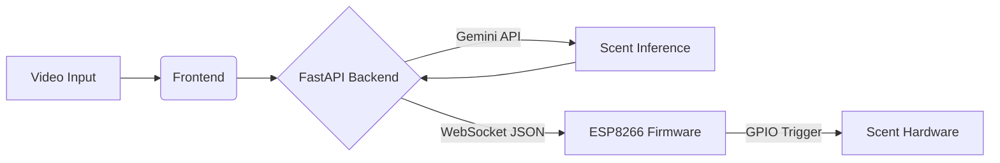

# IoT Scent Reproduction Firmware (ESP8266)

This repository contains the embedded **C++ firmware** for the **MoldSEF Scent Reproduction System**. 

The device acts as an edge node that maintains a persistent WebSocket connection to the central backend. It receives real-time AI-generated scent inference commands and triggers physical hardware actuators (pumps/atomizers) to reproduce the target scent.

Note: *the hardware is still under development*

### Related Repositories
- **Backend (FastAPI/AI):** [github.com/maximbenea/fastapi-backend](https://github.com/maximbenea/fastapi-backend)
- **Frontend (Vite/React):** [github.com/maximbenea/vite-frontend](https://github.com/maximbenea/vite-frontend)

## System Architecture

